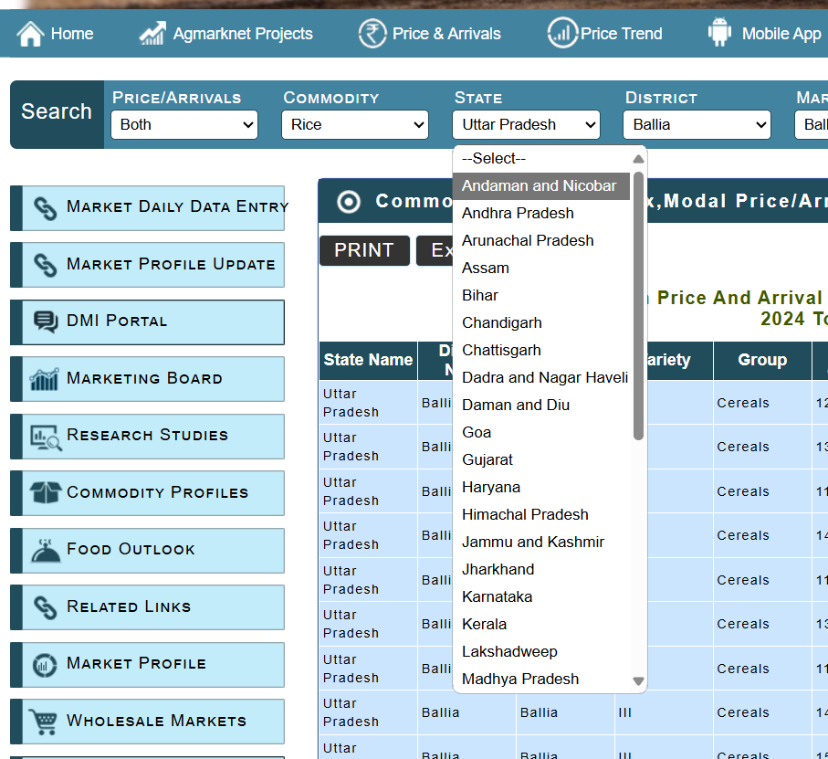

# Price Data Extraction Script for SIH

### step 1:
clone this repository

### step 2:
create a virtual environment by 
`python -m venv venv`

### step 3:
activate the virtual environment by 
`source ./venv/Scripts/activate` \
this works in bash dont know for windows : )

### step 4:
install dependencies by 
`pip install -r requirements.txt`

### step 5:
run `main.py` after change line 19: `STATE_NO = 1` to different numbers one by one

state list is like this with `STATE_NO = 1` referring to `Andaman and Nicobar`

### Different members are expected to run the script for different states

### script will open a browser window (just minimize that and focus on terminal) and most probably save the desired data

 A foldare called `data` will be created. After fetching/writing is done is done for the particular state script will end.

 #### Continue with the next state.

